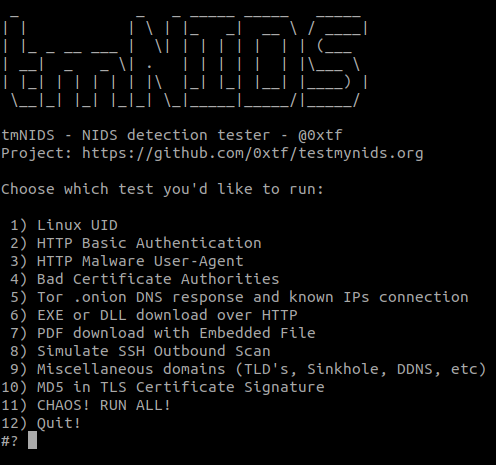

# testmynids.org
A website and framework for testing NIDS detection

## What is it?

A simple project that aims to centralize testing for detection of malicious events by network intrusion detection systems (NIDS). The tests in this project are built against rulesets, not software. Therefor, if you're using ET Open, coverage for these tests will work.

There are two parts to it:

* **A website** - that is used to hold some tests/files. It will also hold sub-domains and DNS records for when testing via DNS is required.
* **A script** - That runs/simulates interaction with the website or with 3rd party websites, meant to be executed on the client for which you want to test coverage of your NIDS sensor.

## Usage

**One-liner to download and execute:** 
```
curl -sSL https://raw.githubusercontent.com/0xtf/testmynids.org/master/tmNIDS -o /tmp/tmNIDS && chmod +x /tmp/tmNIDS && /tmp/tmNIDS
```

To do it manually, download and run the [script](./tmNIDS) *(only requirements are curl and nc, which should be included in your distro)*. You can also run the tests yourself *(outside of tmNIDS)* by looking at the script.

After downloading **tmNIDS** make it executable *(chmod +x tmNIDS)* and run it *(./tmNIDS)* to be presented with the wizard:



## Included tests

* Linux UID (HTTP)
* Basic Authentication over clear text (HTTP)
* Several known malware-related user agents (HTTP)
* Known bad CA's (TLS)
* Tor .onion response and random Tor nodes connection (DNS & HTTPS)
* EXE download over HTTP *(from AWS S3)* & Packed Executable (HTTP)
* PDF download over HTTP with Embedded File (HTTP)
* Simulate an outbound SSH scan (SSH)
* Miscellaneous *(TLD's, Sinkhole, DDNS, etc)* domains (DNS)
* MD5 in TLS Certificate (TLS)

## Have an idea for a new test?

Please let me know. Purpose of this project is to be community-driven. We also want to provide a framework that allows for testing of as many protocols as possible *(DNS, SMTP, HTTP, etc)*.

## Why? What about _insert_project\_here_?

**Why** - We can check if a NIDS engine is working with a simple rule. In most cases, a ping would do. From that moment on, it becomes a matter of rulesets if detection is working or not. The purpose of this project is to quickly verify and showcase detection of as many protocols as possible, while keeping the whole process quick, portable and simple.

**Other projects** - I'm aware that other websites, projects or scripts exist. I created this one because the existing ones were

* lacking features
* no longer supported 
* not portable enough
* too many dependencies

Choose whatever works best for you.
